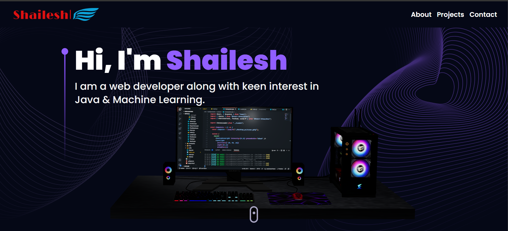
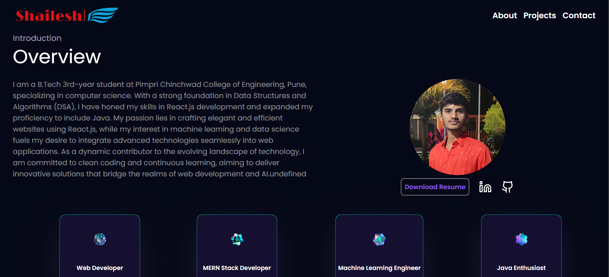
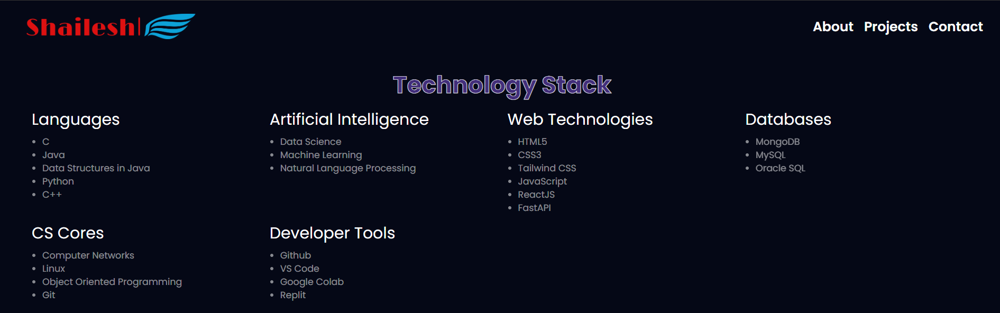
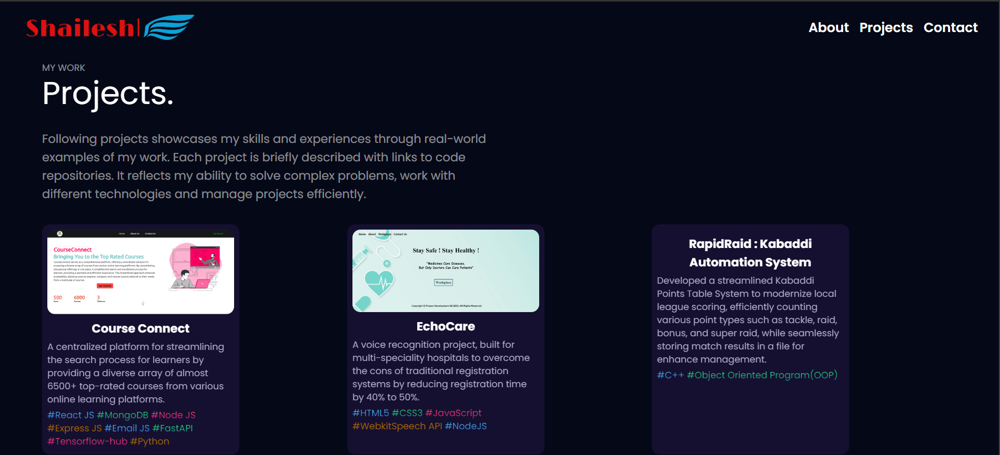
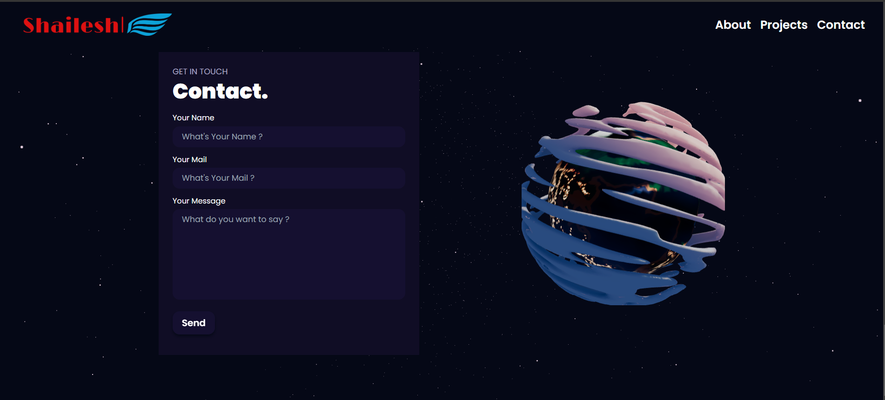

# Shailesh's Portfolio

This is my portfolio showing digital space to get a glimpse of my journey, skills, and projects. 3D models used in it give a mesmerizing looks to my portfolio.

CourseConnect is a powerful course recommendation system built using the MERN (MongoDB, Express.js, React.js, Node.js) stack, along with machine learning and deep learning models powered by FastAPI. This project aims to provide users with personalized course recommendations based on their skills, preferences, and learning patterns. Whether you're a student looking for the perfect course or an enthusiast eager to expand your knowledge, CourseConnect is your gateway to an enriched learning experience.

-  ## Screenshots
- 

- 

- 

- 

- 

## Technologies Used

- **React.js**: Crafted with the power of React for a dynamic and seamless user experience.

- **Tailwind CSS**: Styled using Tailwind for a sleek, responsive, and modern design.

- **Three.js**: Leveraged the capabilities of Three.js to bring interactive 3D elements to life.

- **Email JS:** Sending email directly from your code – no server side code required. Add static or dynamic attachments, dynamic parameters, captcha code and more.
## Contribution
